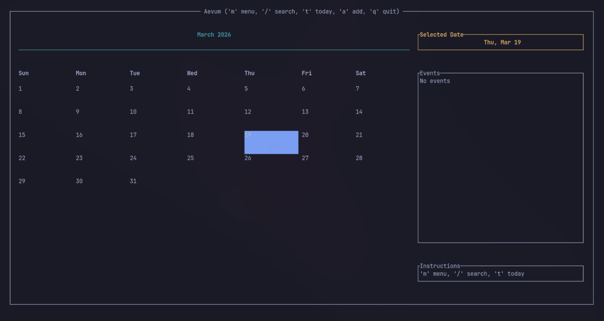

# Aevum

**Aevum** is a high-performance, professional terminal-based calendar application built entirely in Rust. It combines the speed and safety of Rust with a clean, responsive Terminal User Interface (TUI) to help you manage your schedule efficiently without ever leaving your CLI.


---

## 📸 Screenshot



---

## 🚀 Features

- **Responsive TUI**: Built with `ratatui`, the interface dynamically scales to any terminal size with professional spacing and layout.
- **Event Management**:
  - Add events to any date with ease.
  - Interactive "Remove Mode" to select and delete specific entries.
  - Persistent storage using a local `events.json` file.
- **Advanced Navigation**:
  - Intuitive arrow-key navigation.
  - Quick-jump to Today (`t`).
  - Skip forward/backward by months (`n`/`p`) or years (`Shift + N`/`Shift + P`).
- **Live Search**: Full-text search across all events (`/`) with live filtering and instant date jumping.
- **Professional Import/Export**:
  - **CSV Support**: Bulk import or export your schedule.
  - **iCalendar (.ics) Support**: Seamlessly sync with Google Calendar, Outlook, and Apple Calendar.
- **Nested Menu System**: A sleek, modal-driven menu (`m`) for categorized actions.

---

## ⌨️ Keybindings

| Key | Action |
| :--- | :--- |
| `Arrows` | Navigate days/weeks |
| `t` | Jump to today's date |
| `n` / `p` | Next / Previous Month |
| `Shift + N` / `P` | Next / Previous Year |
| `/` | Enter Search Mode (Type to filter, Enter to select) |
| `a` | Add event to selected date |
| `r` | Enter Remove Mode (Select event and press `d` to delete) |
| `m` | Open Action Menu (Import/Export options) |
| `q` / `Esc` | Quit / Exit current mode |

---

## 🛠️ Installation

### Prerequisites
- [Rust](https://www.rust-lang.org/tools/install) (latest stable version)

### Build from source
1. Clone the repository:
   ```bash
   git clone https://github.com/volt-l18/aevum.git
   cd aevum
   ```
2. Build and run:
   ```bash
   cargo run --release
   ```

---

## 📂 Project Structure

Aevum follows a modular architecture for maximum maintainability:

- `main.rs`: Application entry point and terminal lifecycle management.
- `app.rs`: Core business logic, state management, and data persistence.
- `ui.rs`: Component-based UI rendering logic.
- `handler.rs`: Centralized keyboard event and input handling.

---

## 📄 License

This project is licensed under the MIT License - see the LICENSE file for details.

---

*“Aevum — Uninterrupted time for the modern developer.”*
